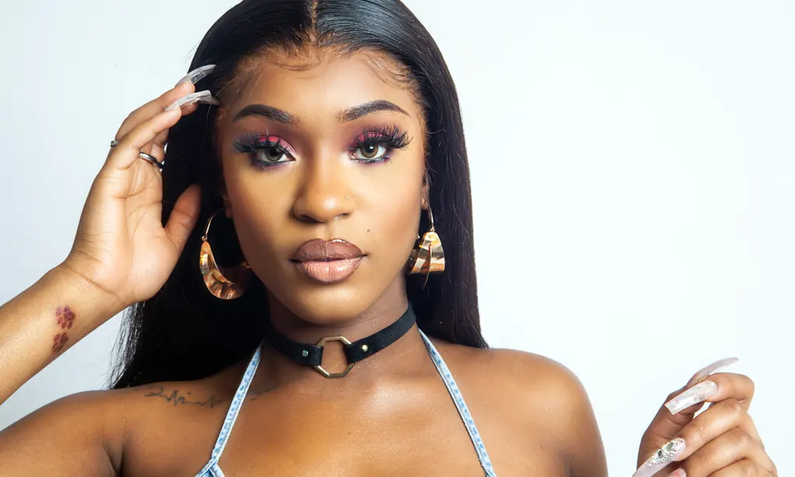
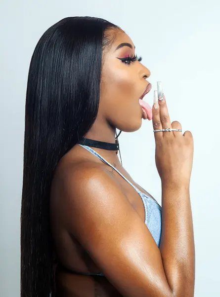

“I didn’t think I would get anywhere, I can’t lie to you,” Ivorian Doll tells me, somewhat unexpectedly. “I mean, I wouldn’t have taken me seriously if I was on the other end.”

In reflecting on the success she’s recently found, the rapper isn’t as assured as you would expect from an artist of her standing. This has been a whirlwind year: after a string of million-streaming releases, plus features with fellow UK stars Headie One, Ray BLK, S1mba and more, the “queen of drill” – self-titled, but deserving of it – will release her much-anticipated debut EP Renaissance this month.

Born Vanessa Mahi in Germany to parents hailing from Ivory Coast and moving to east London aged three, she originally found fame as a popular YouTube personality known for playful “storytimes”: audacious tales of cheating boyfriends, sugar daddies and scandalous behaviour. She reckons she has long been musically inclined, but just hadn’t realised. “I was always performing, and we’d make up dance routines,” she says of her teenage years, detailing the verses she and friends created to offend rival boys. “We made up this fake gang called CGG’s – we even had our own theme song and diss track.”

“I didn’t think I would get anywhere, I can’t lie to you,” Ivorian Doll tells me, somewhat unexpectedly. “I mean, I wouldn’t have taken me seriously if I was on the other end.”

In reflecting on the success she’s recently found, the rapper isn’t as assured as you would expect from an artist of her standing. This has been a whirlwind year: after a string of million-streaming releases, plus features with fellow UK stars Headie One, Ray BLK, S1mba and more, the “queen of drill” – self-titled, but deserving of it – will release her much-anticipated debut EP Renaissance this month.

Born Vanessa Mahi in Germany to parents hailing from Ivory Coast and moving to east London aged three, she originally found fame as a popular YouTube personality known for playful “storytimes”: audacious tales of cheating boyfriends, sugar daddies and scandalous behaviour. She reckons she has long been musically inclined, but just hadn’t realised. “I was always performing, and we’d make up dance routines,” she says of her teenage years, detailing the verses she and friends created to offend rival boys. “We made up this fake gang called CGG’s – we even had our own theme song and diss track.”

Spats with fellow vloggers regularly made waves on UK gossip blogs and trended on social media, so when she jokingly dropped a track with rapper Abigail Asante during one altercation, responses were understandably mixed. “People weren’t supportive and didn’t take me seriously – also because I was a female doing drill, which wasn’t really seen before. I secretly wanted to stop, but you couldn’t tell.”

But then came her breakout single Rumours. Released begrudgingly as a final effort to launch her now-solo career – the “last one” before giving up, she says – the strength of the track turned opinion. Now with more than 5m views on YouTube, it was a song that would skilfully attract various sets of listeners: drill fans hungry for dextrous flows over the punchy, snare-backed beats typical of the genre, but also her social media following. They were drawn by brazen braggadocio detailing her beauty and sexual prowess, and visceral lyrical references to the reputation aroused by her online drama (“they say I’m leaking from the STDs I got”).

“The song was saying: ‘If you lot think this stuff is true, then let me tell you about it,’” she explains, saying that it actually detoxified her brand: “People thought: she don’t care, so why should we?”

Her rise, though, has allegedly been hampered by a management deal she entered into with Oliver Ashley, son of Sports Direct’s Mike Ashley, who has recently applied for trademarks for the name Ivorian Doll. On Twitter, she accused him of unfair financial terms and controlling which label she was allowed to sign to; she begged to be let go from the contract. Ashley has not responded and could not be reached for comment, and Mahi, who made the allegations after we spoke, would not comment further.

The situation badly needs resolving, as there has been space in drill for a woman like her for some time. The style is known for bleak themes and stories of real-world violence, and suffers from a reputation as a boys’ club. But Ivorian’s ability to play with a mix of styles has granted her respect from her male peers, and refreshed the genre as a whole. “I’m not so ‘boyish’ about it,” she says of her artistry. “I’m not wearing the tracksuits; I’m very sexy with it. I feel like that’s what’s making me stand out because I’m making it different.”

Her new EP is evidence of the sounds she’s willing to toy with, like smoother, mellower rhythms similar to afro-swing, and bouncier, chart-friendly rap. The release after that may include more women, as fellow artists such as Shaybo, Br3yna and Teezandos make their own mark, mirroring the golden era for female rappers in the US. “When I first started, the sexism was just ridiculous. It’s even made me more of a feminist,” she says. “I think it would be good to see other girls make drill a bit more sexy, more fun! It doesn’t need to be dark or violent. Drill is a beat, it’s not what you talk about. So I’d love more girls involved, because that’s what makes the genre bigger.”
