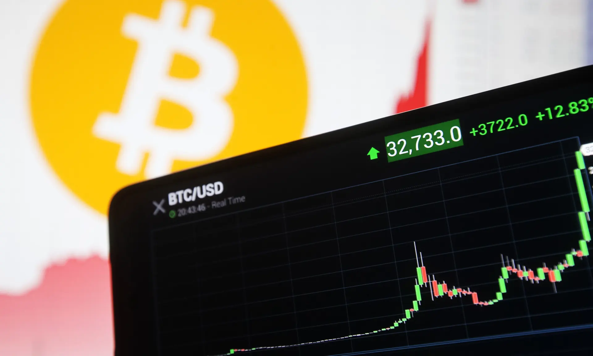
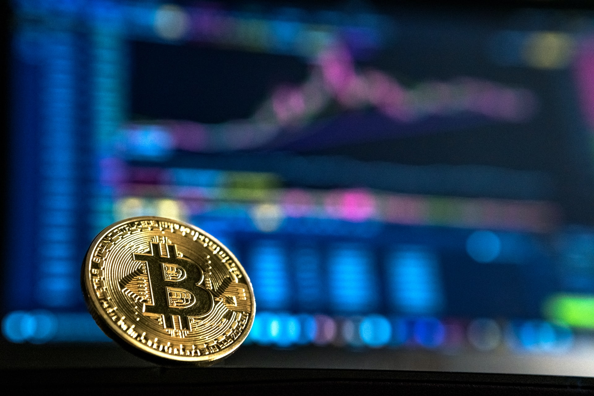

Bitcoin has surged to a record high amid rising interest from investors and claims that the volatile cryptocurrency is on the way to becoming a mainstream payment method.

Having quadrupled in value during 2020, bitcoin began 2021 strongly by breaking through the $30,000 (£22,000) mark for the first time, less than three weeks after first trading above $20,000.

On Sunday, it hit a new high of more than $34,800, on the 12th anniversary of the bitcoin network being created.

Bitcoin’s rapid climb has rekindled memories of previous parabolic rallies and crashes. During 2017, it leapt from about $1,000 to peak over $19,000, before tumbling to below $4,000 by the end of 2018.

But this latest rally comes as some financial institutions show growing interest in bitcoin as an asset class, and as its supporters argue that it is supplanting gold as a store of value.

“The number keeps going up as the market has seemingly never been more bullish,” said Paolo Ardoino, the CTO of cryptocurrency exchange Bitfinex. “We see a very bright future ahead for all bitcoin holders.”
Bitcoin surges to record $28,500, quadrupling in value this year
Read more

With the US dollar at its lowest level since spring 2018, advocates of cryptocurrencies claim they protect against inflationary money-printing by central banks, which launched unprecedented stimulus programmes last year amid the Covid-19 pandemic.

“Some will argue that there is more to come from both gold and bitcoin, especially if governments keep piling up debts and central banks do their best to fund that borrowing through the backdoor with quantitative easing, zero interest rates and bond yield manipulation, thanks to the scarcity value relative to cash,” said Russ Mould, the investment director of UK investment platform AJ Bell.

“Others will argue neither gold nor bitcoin have intrinsic value, as they do not generate cash,” he added.
Everything you wanted to know about bitcoin but were afraid to ask
Read more

Bitcoin received a boost from PayPal last autumn, when the bank announced it would allow customers to buy, sell and use the cryptocurrency. Analysts said this could be driving the price surge, by creating a shortage as PayPal buys up newly created bitcoins.

There are more than 18m bitcoins in existence, created by the miners who provide the computational power underpinning the blockchain, which records transactions made using bitcoin. The system has a hardwired maximum of 21m coins.

Sunday’s latest record high came 12 years to the day after Satoshi Nakamoto, the pseudonymous creator of bitcoin, created the first entry in the bitcoin blockchain.

This “genesis block” included a headline from the 3 January 2009 edition of the Times, reading: “Chancellor on brink of second bailout for banks”.

City firms have shown more interest in bitcoin recently. In December, the UK investment management firm Ruffer said it held £550m in bitcoin, as a hedge to the risks in a “fragile monetary system and distorted financial market”.

The hedge fund managers Stanley Druckenmiller and Paul Tudor Jones have also backed bitcoin as a financial asset. Druckenmiller argued that it could have “a lot of attraction as a store of value to both millennials and the new west coast money”.

Sceptics warn that the crypto boom could be heading for trouble. The economics professor Nouriel Roubini, a long-time critic of bitcoin, insists it has no intrinsic value.

“The price of bitcoin is totally manipulated by a bunch of people, by a bunch of whales. It doesn’t have any fundamental value,” he told Yahoo Finance just before Christmas. “We’re close to the point where the hyperbolic bubble is going to go bust.”
